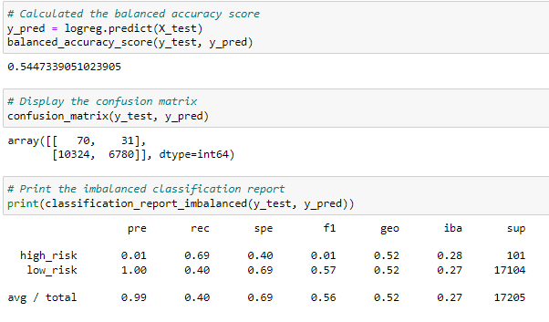

# Credit_Risk_Analysis

## Overview of the loan prediction risk analysis
Using Python to build and eveluate machine learning models to predict credit risk.

## Resources
* ### Software:
  * Jupyter Notebook
  * Python
* ### Data Source 
  * LoanStats_2019Q1.csv
  
## Results
### Oversampling Model

Oversampling result: the balanced accuracy score is 65% with the high risk precision that is about 1% with a sensitivity of 69% and F1 2%.

### SMOTE model
 
The SMOTE result: the balanced accuracy score is 66% with the high risk precision that is about 1% with a sensitivity of 63% and F1 2%.

### Undersampling 
 
Undersampling result: the balanced accuracy score is 54% with the high risk precision that is about 1% with a sensitivity of 69% and F1 1%.

### Combination of Over and Undersampling
 
Combination result: the balanced accuracy score is 64% with the high risk precision that is about 1% with a sensitivity of 71% and F1 2%.

### BalancedRandomForestClassifier
 
BalancedRandomForestClassifier result: the balanced accuracy score is 78% with the high risk precision that is about 3% with a sensitivity of 70% and F1 6%.

### EasyEnsembleClassifier
 
EasyEnsembleClassifier result: the balanced accuracy score is 93% with the high risk precision that is about 9% with a sensitivity of 94% and F1 16%.

## Summary
After comparing different models using Balanced Accuracy and F1 scores, it appears that the Easy Ensemble AdaBoost Model is the best option for this dataset. While there are concerns about overfitting, the model's use of random undersampling during each bootstrap can help alleviate this issue. However, the low precision scores for high-risk loans are troubling. If high-risk loan labels have a high probability of false positives, this may lead to the continuation of harmful lending practices that have contributed to socio-economic disparities based on geography, race, and economics. Although the sample size for high-risk loans is small, the potential impact on affected individuals is significant.
